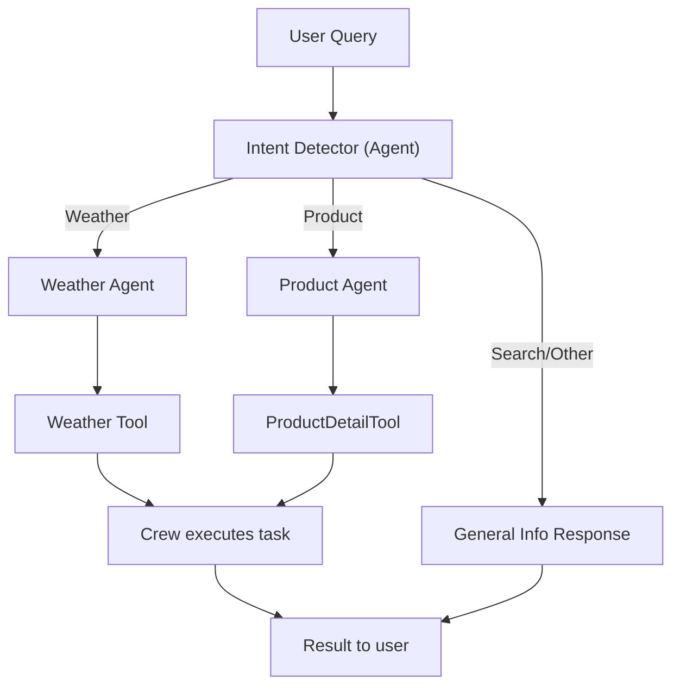

## CrewAI Multi‑Agent Router

### Overview

This project demonstrates a minimal, production‑ready pattern for routing user queries to specialized agents using CrewAI. A lightweight Intent Detector classifies each query and then routes it to the appropriate specialist:

- **Weather Agent**: answers weather questions using a tool
- **Product Agent**: returns product details using a tool
- **General**: provides a generic informational response for everything else

The system runs sequentially and uses OpenAI via `langchain-openai`.

### Project Structure

```
CrewAiMultiAgent/
  ├─ assets/
  │  ├─ screenshot 1.png
  │  ├─ screenshot 2.png
  │  ├─ screenshot 3.png
  │  ├─ screenshot 4.png
  │  └─ screenshot 5.png
  ├─ main.py
  ├─ requirements.txt
  ├─ LICENSE
  └─ README.md
```

### Architecture Flow



### Key Components

- **Intent Detector**: Classifies a query into Weather, Product, or General
- **Weather Agent**: Uses `weather_tool(location)` to respond
- **Product Agent**: Uses `ProductDetailTool` to respond
- **Sequential Process**: Each query is classified first, then routed

### Prerequisites

- Python 3.10+
- An OpenAI API key

### Setup

```bash
python -m venv .venv
source .venv/bin/activate  # Windows: .venv\Scripts\activate
pip install -r requirements.txt
```

Create a `.env` file in the project root:

```bash
echo "OPENAI_API_KEY=your_openai_api_key_here" > .env
```

### Run

```bash
python main.py
```

The script will run three sample queries to exercise all routes (Weather, Product, General).

### Configuration

- Model is configured in `main.py` via `ChatOpenAI(model="gpt-3.5-turbo", temperature=0.1)`.
- To change the model, update the `model` parameter or set your own initialization logic.

### Screenshots

Below are screenshots from the `assets` folder to illustrate the flow and output examples.


### Extending

- Add a new agent by defining a tool (if needed) and creating a new `Agent` in `main.py`.
- Extend the intent classification prompt to include new categories and update the routing logic accordingly.

### License

This project is licensed under the MIT License. See the `LICENSE` file for details.
